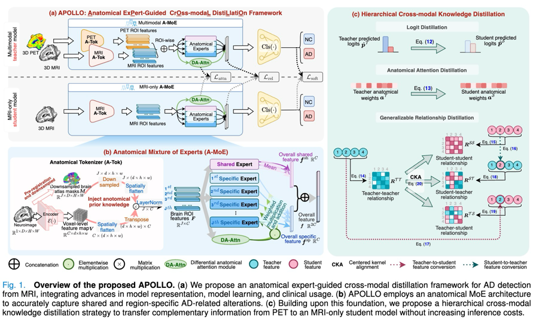

# APOLLO-for-Alzheimer-disease

Official implementation of "APOLLO: Anatomical Expert-Guided
Cross-Modal Distillation Framework for
Alzheimer’s Disease Detection."

## Approach
  

# Updates
July, 2025: initial commit for core model architecture and loss functions

# Data PrePration
ADNI, NACC, and AIBL datasets

## Requirements
```
- Linux Platform
- torch==1.12.1+cu113 # depends on the CUDA version of your machine
- torchvision==0.13.1+cu113
- Python==3.8.0
- numpy==1.22.3
```

## Traning and & Inference